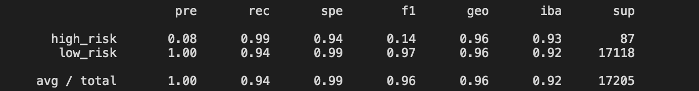

# Credit_Risk_Analysis
Mod 17 Challenge

## Summary
The purpose of this challenge was to experiment with a variety of different machine learning models in order to see which one was most effective at predicting credit risk.

## Results
* Naive Random Oversampling 
As you can see below, the precision of our Naive Random test is quite high. It does not perform as well in recall, where it is only .64. 

* Smote
Here we see good precision as above, but here the recall is much higher at .90.

* Cluster Centroids
Our Cluster Centroids model performs the best so far, with it having a .99 precision and .94 recall. 

* Smoteen
The Smoteen model performs slightly less higher than the Cluster centroids, coming in with .94 precision and .89 recall. 

* Balanced Random Forest
The Balanced Random Forest model has very high percision and recall, coming in at 1.00 and .91 respectively.

* Ensemble
The Easy Ensemble model outperforms the Balanced forest by just a few points, with 1.0 percision andd .94 recall. 

* We also see that the accuracy scores for each test below the image of the classification report. The two highest percentages of are for the Ensemble method and the Cluster Centroid model. 

## Analysis
As noted above, the two best performing tests for this particular dataset are the Easy Ensemble andd the Cluster Centroid. The recall in the Cluster Centroid is lower however, so in this case I would use the Easy Ensemble model. 
