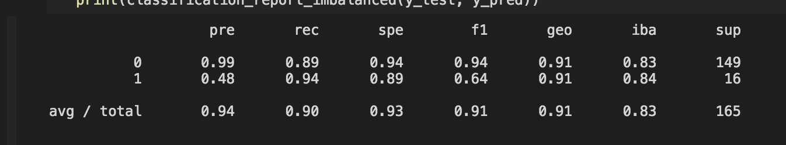
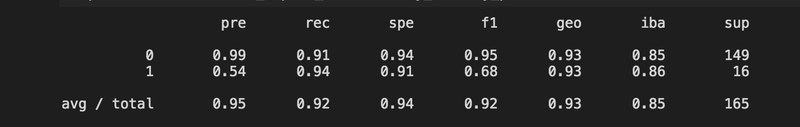
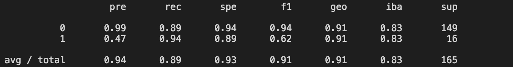
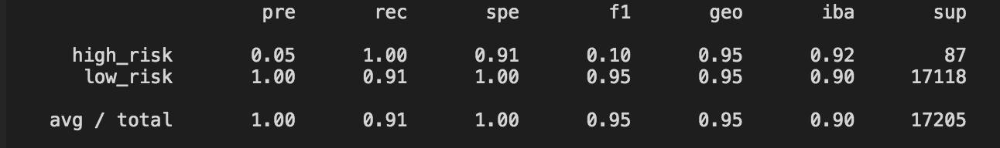

# Credit_Risk_Analysis
Mod 17 Challenge

## Summary
The purpose of this challenge was to experiment with a variety of different machine learning models in order to see which one was most effective at predicting credit risk.

## Results
* Naive Random Oversampling 

* Smote

* Cluster Centroids

* Smoteen

* Balanced Random Forest

* Ensemble

